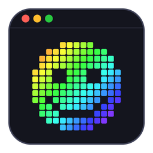
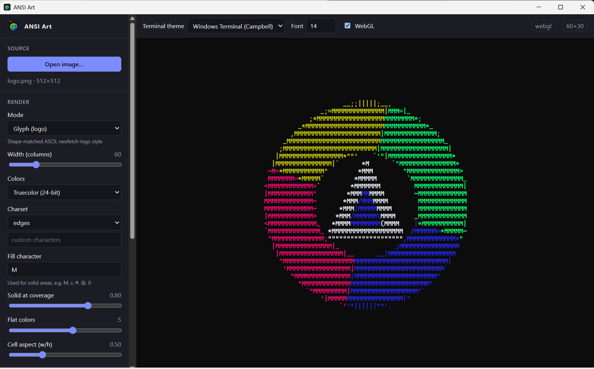
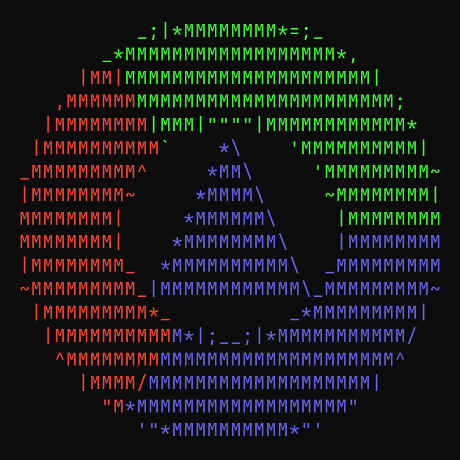
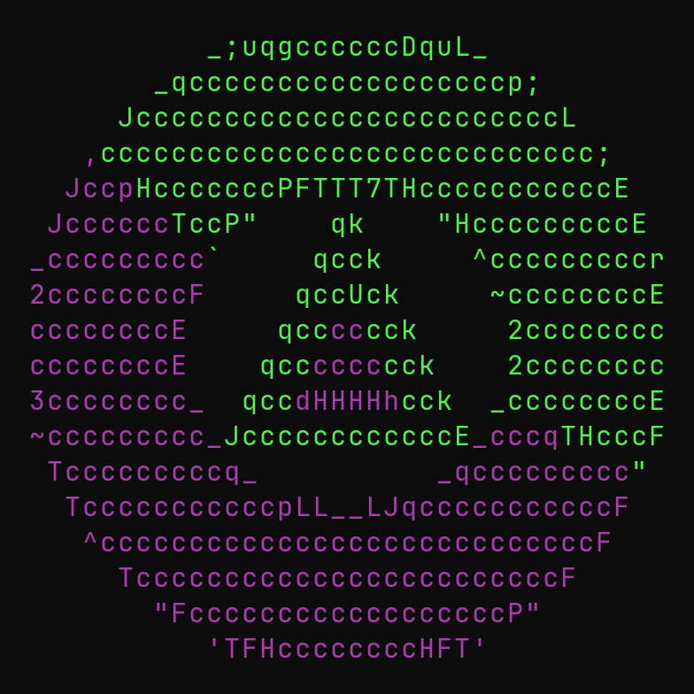
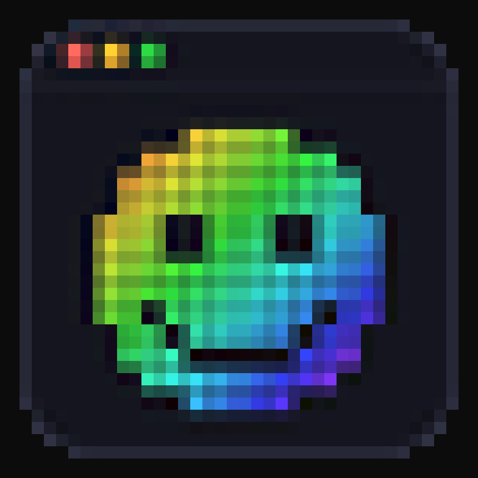
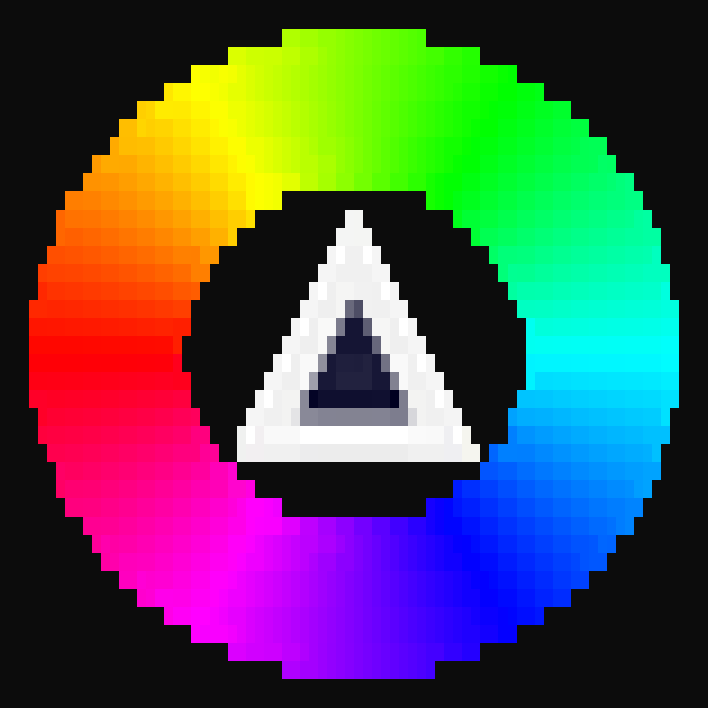
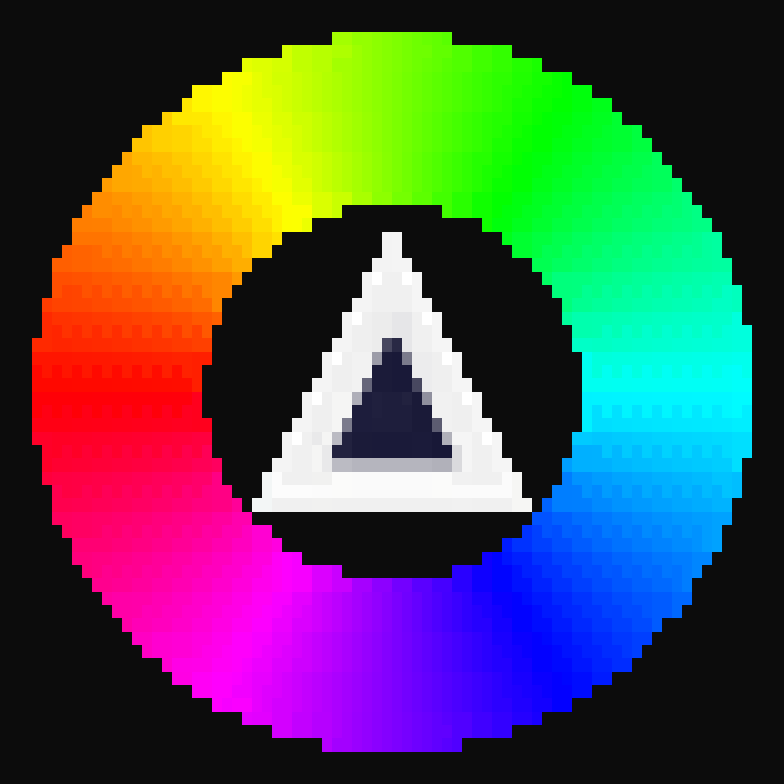
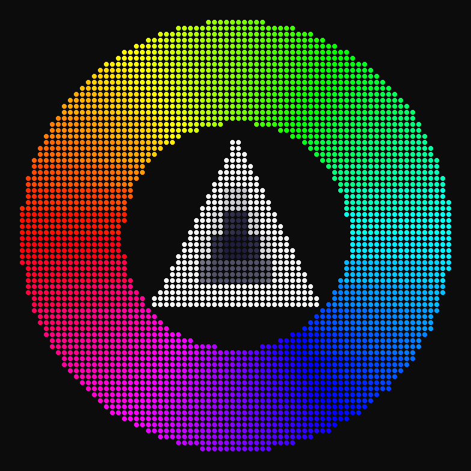
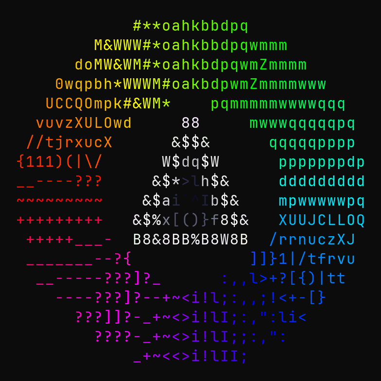
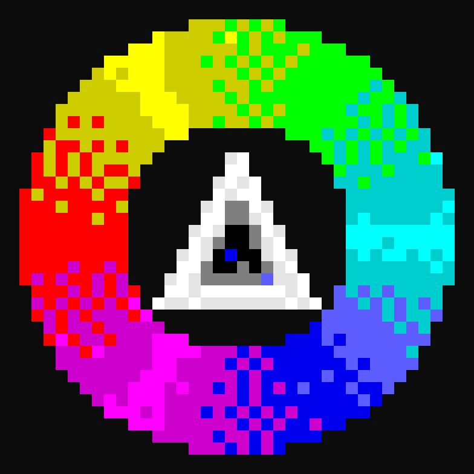

<div align="center">



# ANSI Art

**Turn PNG / JPG images into terminal art: neofetch-style logos, half-blocks, braille, sextants and more.**

One Rust engine, a desktop app with a live terminal preview, and a CLI.

[](LICENSE)




</div>

## Features

- **8 render modes**: from classic ASCII to shape-matched logo art and high-resolution Unicode blocks
- **5 color depths**: truecolor, 256, 16, 8 and monochrome, with Floyd–Steinberg, Atkinson and Bayer dithering
- **8 export formats**: ANSI, plain text, HTML, JSON, shell script, PowerShell script, **neofetch** and **fastfetch** logos
- **Live preview in a real terminal emulator** ([xterm.js](https://xtermjs.org/)), with switchable terminal themes to check how 16-color output looks elsewhere
- **Tone controls**: brightness, contrast, gamma, saturation, invert
- **Transparency aware**: transparent pixels stay empty so the terminal background shows through
- **Cross-platform**: Windows, macOS and Linux; the CLI auto-detects your terminal's color support

## Gallery

All samples are 40 columns wide, rendered by the CLI. Regenerate them with `python docs/render-samples.py`.

<table>
  <tr>
    <td align="center"><br /><b>glyph</b>: shape-matched, 3 flat colors</td>
    <td align="center"><br /><b>glyph</b>: <code>--charset letters --fill c</code></td>
  </tr>
  <tr>
    <td align="center"><br /><b>half-block</b> <code>▀</code>: 1×2 pixels per cell</td>
    <td align="center"><br /><b>quadrant</b> <code>▚</code>: 2×2 pixels, two colors</td>
  </tr>
  <tr>
    <td align="center"><br /><b>sextant</b> <code>🬗</code>: 2×3 pixels, two colors</td>
    <td align="center"><br /><b>braille</b> <code>⣿</code>: 2×4 dots</td>
  </tr>
  <tr>
    <td align="center"><br /><b>ascii</b>: <code>--ramp detailed</code></td>
    <td align="center"><br /><b>16 colors</b> + Floyd–Steinberg dithering</td>
  </tr>
</table>

## Render modes

| Mode | Pixels per cell | Best for |
|---|---|---|
| `glyph` | shape-matched | Distro-style logos made of characters (`.` `'` `:` `\|` edges, solid fill) |
| `half-block` | 1×2 | Faithful color images, fastfetch-style; works almost everywhere |
| `quadrant` | 2×2 | Sharper edges, two colors per cell |
| `sextant` | 2×3 | Even sharper; needs a recent font (Cascadia, JetBrains Mono, Iosevka) |
| `braille` | 2×4 | Line art and fine detail, one color per cell |
| `block` | 1×1 | Maximum compatibility |
| `shade` | 1×1 | Retro look with `░▒▓█` |
| `ascii` | 1×1 | Classic character ramps (7 presets or your own) |

### Glyph mode

Glyph mode recreates the hand-made look of neofetch distro logos. It reduces the image to a few flat colors (k-means), then for each cell picks the character whose **shape** best matches that part of the image: `.` and `_` for bottom edges, `'` and `` ` `` for top edges, `|` and `:` for sides, and a fill character (`M`, `c`, `#`, …) for solid areas. Character shapes are rasterized from the bundled JetBrains Mono font, so results are identical on every OS.

The background is taken from transparency, or detected from the image border for JPGs.

## Getting started

### Prerequisites

- [Rust](https://rustup.rs) (stable)
- [Node.js](https://nodejs.org) 20+ and [pnpm](https://pnpm.io)
- Tauri system dependencies: see the [Tauri prerequisites](https://v2.tauri.app/start/prerequisites/)
  - **Windows**: WebView2 (built into Windows 10/11) and the MSVC build tools
  - **Linux**: `webkit2gtk-4.1`, `libayatana-appindicator3`, `librsvg2`
  - **macOS**: Xcode Command Line Tools

### Desktop app

```sh
cd app
pnpm install
pnpm tauri dev      # run with hot reload
pnpm tauri build    # installers: .msi/.exe, .deb/.rpm/.AppImage, .dmg
```

Open an image with **Open image…** or drag it onto the window, tweak the settings, and the preview updates live. **Export…** saves the result in any format.

### CLI

```sh
cargo install --path crates/ansi-cli    # installs `ansi-art`

ansi-art logo.png                                     # half-block, colors auto-detected
ansi-art logo.png -m glyph -w 40                      # neofetch-style logo
ansi-art logo.png -m glyph --charset letters --fill c --glyph-colors 2
ansi-art logo.png -m braille -c ansi256 -d bayer8     # braille, 256 colors, ordered dither
ansi-art logo.png -m ascii --ramp detailed -c mono    # classic ASCII
ansi-art logo.png -m sextant -o logo.ans              # format inferred from extension
ansi-art --help                                       # all options
```

## Use it as your neofetch / fastfetch logo

```sh
ansi-art logo.png -m glyph -w 40 -f neofetch -o logo.txt
# prints: neofetch --ascii logo.txt --ascii_colors 63 83 203

ansi-art logo.png -m glyph -w 40 -f fastfetch -o logo.txt
# prints: fastfetch --logo logo.txt --logo-type file --logo-color-1 '38;2;104;102;240' …

# Any mode, full color, as raw ANSI:
ansi-art logo.png -w 40 -o ~/.config/fastfetch/logo.ans
fastfetch --file-raw ~/.config/fastfetch/logo.ans
```

The neofetch and fastfetch formats keep foreground colors only (up to 6 and 9 colors), so they suit the `glyph`, `ascii` and `braille` modes. The desktop app shows the matching command after exporting.

## Export formats

| Format | Extension | Notes |
|---|---|---|
| `ansi` | `.ans` | Raw escape codes (UTF-8). `cat` it, use as MOTD or with `fastfetch --file-raw` |
| `plain` | `.txt` | Characters only |
| `html` | `.html` | Standalone page |
| `json` | `.json` | Cell grid (`ch`, `fg`, `bg`) for other tools |
| `sh` | `.sh` | POSIX script that prints the art |
| `ps1` | `.ps1` | PowerShell 5.1+ script (saved with BOM so 5.1 reads UTF-8) |
| `neofetch` | `.txt` | `${c1}`…`${c6}` placeholders + `--ascii_colors` hint |
| `fastfetch` | `.txt` | `$1`…`$9` placeholders + `--logo-color-N` hint |

## Compatibility

| Concern | How it is handled |
|---|---|
| Color depth | Truecolor → 256 → 16 → 8 → mono. The CLI detects it from `COLORTERM`, `TERM` and `WT_SESSION`, and respects `NO_COLOR`. |
| 256 colors | Only palette entries 16–255 are used, since 0–15 change with every terminal theme. |
| Legacy Windows console | The CLI enables VT processing automatically. |
| Fonts | Half-block, quadrant and braille are in nearly every font; sextants need a recent one. When in doubt use `block` or `ascii`. |
| Line safety | Every line ends with a reset (`ESC[0m`), so output can be cut or concatenated safely. |

### Linux / WebKitGTK

All image processing runs in Rust; the webview only receives finished ANSI text. The preview uses xterm.js's WebGL renderer and **falls back to the DOM renderer** if WebGL fails or loses its context (you can also turn it off with the WebGL toggle). On NVIDIA GPUs the app sets `WEBKIT_DISABLE_DMABUF_RENDERER=1`, unless you set it yourself, to avoid a blank window.

## Project structure

```
ansi-art/
├── crates/
│   ├── ansi-core/        Engine: load → resample → adjust → dither → render → export
│   │   ├── src/render/   Render modes (glyph, ascii, shade, block, half-block, quadrant, sextant, braille)
│   │   ├── src/export/   Output formats
│   │   ├── src/color.rs  Palettes, quantization, k-means
│   │   ├── src/dither.rs Floyd–Steinberg, Atkinson, Bayer 4×4 / 8×8
│   │   └── assets/       JetBrains Mono (OFL) for glyph matching
│   └── ansi-cli/         The `ansi-art` command
├── app/                  Desktop app: Tauri 2 + Svelte 5 + xterm.js
│   ├── src/              UI and terminal preview
│   └── src-tauri/        Rust backend (load / render / export commands)
├── docs/                 Screenshot, gallery and the script that renders it
└── samples/              Test images
```

## Roadmap

- Render: ASCII edge detection (Sobel), octants (Unicode 16), blue-noise dithering
- Export: PNG and SVG, CP437 `.ans` with SAUCE, code snippets (C / Rust / Python / Go), mIRC colors
- Perceptual color quantization (OKLab) and custom palettes
- Auto-crop, background color, resize filter choice
- Animated GIF support

## License

[MIT](LICENSE). The bundled JetBrains Mono font is licensed under the [SIL Open Font License 1.1](crates/ansi-core/assets/OFL.txt).
